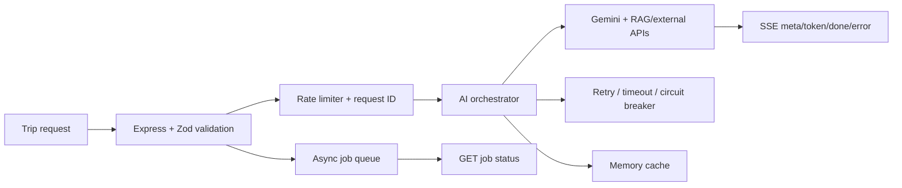

# AI Trip Planner — Backend

Node.js + TypeScript backend for AI itinerary generation. It demonstrates Gemini orchestration, retrieval-assisted context, validation, retries, caching, rate limits, and REST/SSE boundaries without claiming production capacity or an SLA.

## Problem

Itinerary generation is a long-running, failure-prone AI workflow. This service exposes both a streaming request path for interactive clients and an async job path for queue-style consumers, with schema validation and explicit error handling.

## Architecture



## Current APIs

| Route | Behavior |
|---|---|
| `GET /api/v1/health` | Service health |
| `POST /api/v1/itinerary/generate` | Validated generation; cached JSON or SSE stream |
| `POST /api/v1/itinerary/generate-async` | Returns `202` and a job ID |
| `GET /api/v1/itinerary/jobs/:id` | Reads async job status |
| `POST /api/v1/itinerary/evaluate` | Scores a supplied itinerary/request pair |

The frontend uses `/api/v1/itinerary/generate`. The older README’s async-only flow was incomplete.

## Quickstart

### 1. Clone and install

```bash
git clone https://github.com/Yashsh101/ai-trip-planner-backend.git
cd ai-trip-planner-backend
npm ci
```

### 2. Configure

```bash
cp .env.example .env
# Set GEMINI_API_KEY for real generation.
# Configure Firebase/Redis/external API values only for the features you use.
```

Never commit `.env`, Firebase credentials, or provider keys.

### 3. Run

```bash
npm run dev
```

Use `npm run build && npm start` for the compiled server. The default port is controlled by `PORT`.

## Verification

```bash
npm ci
npm run type-check
npm run lint
npm test
npm run build
```

CI runs these checks and builds the RAG index. No live generation or performance number is claimed without a configured provider and fixed test inputs.

## Evaluation

- **Dataset:** No representative travel benchmark is committed.
- **Metrics:** The evaluator route exists, but quality, latency, throughput, and cost results are **pending verification**.
- **Baseline:** No external baseline is claimed.
- **Reproduction:** Use `POST /api/v1/itinerary/evaluate` with a validated itinerary/request pair; add a versioned fixture before publishing scores.

## Failure handling and security

- Zod rejects malformed trip requests before orchestration.
- Provider failures are translated into structured application errors; SSE errors terminate the stream safely.
- Retry, timeout, circuit-breaker, and rate-limit settings are environment-controlled.
- Firebase private keys and API credentials must stay in deployment secrets.
- Memory cache and the in-process job queue are not durable multi-instance infrastructure.

## Deployment status and roadmap

Docker and CI configuration are present. A verified public backend URL is **pending verification**. Before sharing a deployment, verify health, generation, SSE completion, and job-status behavior with non-production test credentials.

Roadmap: add a deterministic SSE contract fixture, persistent queue/cache, realistic itinerary evaluation data, load testing, and an end-to-end staging check with the frontend.

## License

MIT — see [`LICENSE`](LICENSE).
